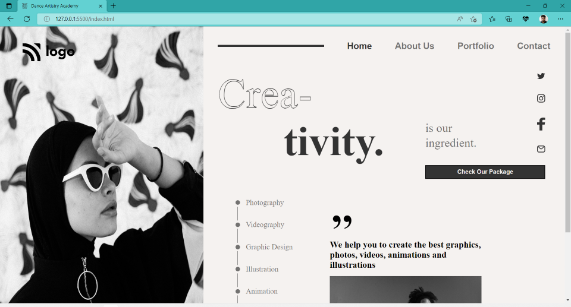
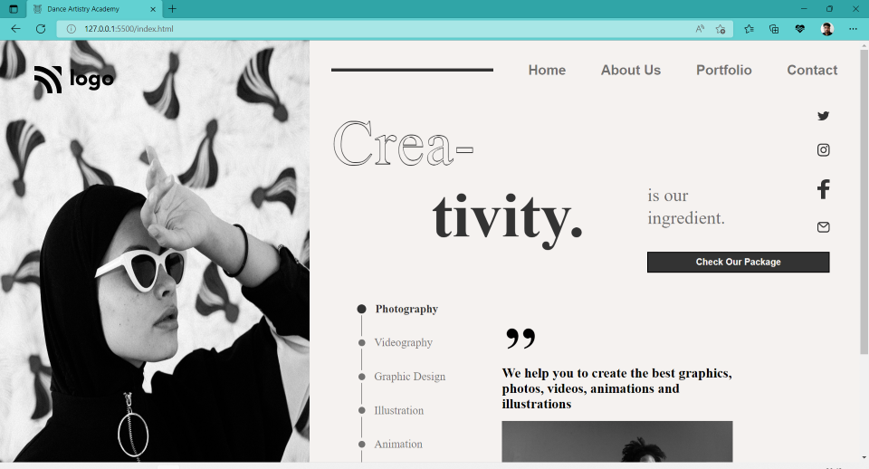
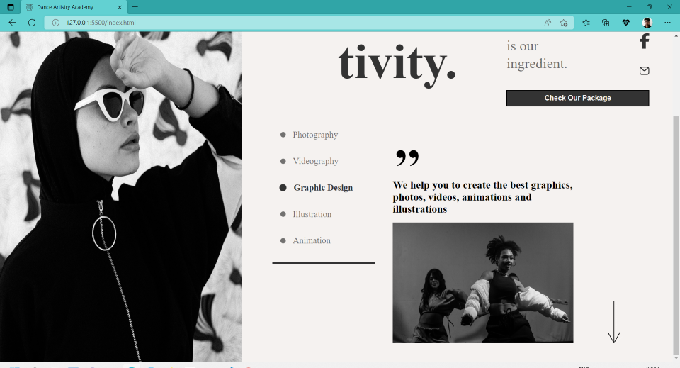
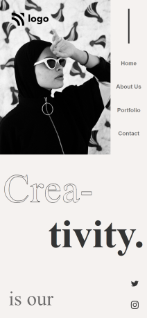
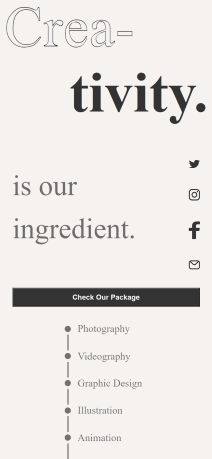
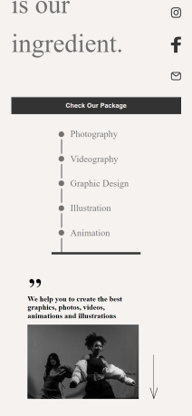

# Project-14 - An-Artists-Academy's-Landing-Page

## Description:

> An-Artists-Academy's website's fully-responsive Landing page which will be the first web page that the potential client will see when they reach Academy's website.

# 

**Landing-Page-Images:**

**Mobile Screenshots:**

#

## What I have learnt while making this project?

> Thanks to the previous projects, this project was not much challenging other than making it fully-responsive on devices of all sizes, but it helped me get better with using HTML & CSS to create stunning Landing pages without the use of any external libraries like Bootstrap or Tailwind CSS.

#

## Time taken to complete this project:
> Around 4 hrs spent in developing this Landing Page.

#

## Please see this project in action at below link:

**[Click to redirect to Project-14](https://p14-dance-artistry.netlify.app/)**

#

## Developed by:

**Sidharth Pandey**

**[Contact Me](mailto:sidp0008@gmail.com)**

#